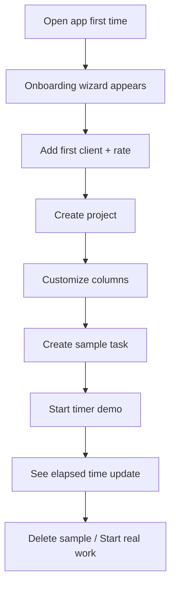
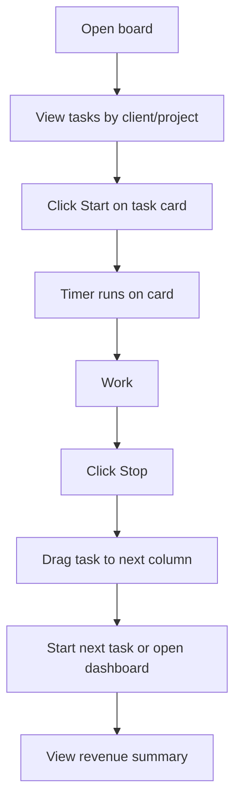
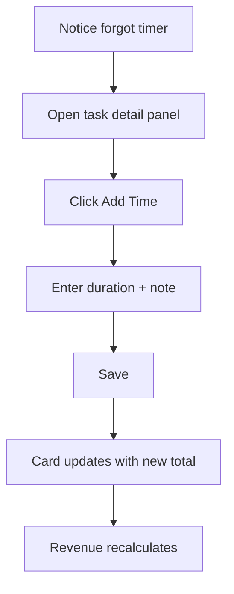
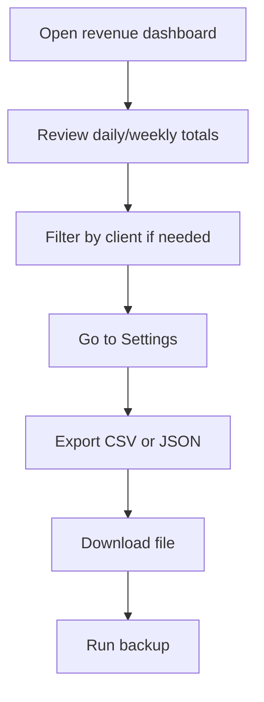

# UX Design Specification bmad-freelancer-tracking-demo-application-v6

**Author:** Marlon
**Date:** 2026-03-11

---

## Executive Summary

### Project Vision

A desktop-first web app that unifies kanban task management and time tracking for solo freelancers. Time tracking lives directly on task cards—no separate app or screen—reducing friction and improving billable-hour capture. The product is freelancer-specific (billable vs non-billable, hourly rates, revenue views) and privacy-first (local storage, no telemetry).

### Target Users

Solo freelancers managing multiple clients and projects who need accurate billable hours, clear revenue visibility, and minimal context switching. Desktop-focused users in long work sessions, often juggling Trello/Asana with separate timer tools.

### Key Design Challenges

- **Information density:** Task cards must surface title, client/project, timer status, time spent, billable indicator, and revenue without clutter.
- **Timer visibility:** Active timer must be obvious across the board and when the tab is inactive.
- **Flow efficiency:** Core actions (start timer, move task, toggle billable) must be one-tap from the board.
- **Onboarding:** New users must reach their first task with a running timer in under 5 minutes.

### Design Opportunities

- **Kanban-first UX:** All core actions happen on the board without navigation to separate screens.
- **Revenue visibility:** Real-time revenue on cards and dashboard to support billing and invoicing.
- **Recovery flows:** Simple manual time entry for "forgot to start timer" scenarios.

## Core User Experience

### Defining Experience

The core experience centers on the **timer-on-card loop**: users start a timer on a task, work, stop it, and move the task—all from the kanban board. The most frequent action is starting and stopping the timer; this must be one-tap and always visible. The board is the primary surface; no separate screens for time tracking.

### Platform Strategy

Desktop-first web app (SPA/PWA) at 1024px+ width. Mouse and keyboard primary. Offline-capable after first load. Target browsers: Chrome, Firefox, Safari, Edge (last 2 versions). Responsive down to ~768px without breaking core flows.

### Effortless Interactions

- **Timer control:** One tap to start/stop on the card; no extra clicks or modals.
- **Task movement:** Drag-and-drop between columns with clear feedback.
- **Billable toggle:** One tap on the card.
- **Background timer:** Keeps running when tab is inactive.
- **Auto-save:** No save button; changes persist automatically.

### Critical Success Moments

- **First timer:** New user has a running timer on a task within 5 minutes.
- **Revenue visibility:** User sees billable hours and revenue on the dashboard.
- **Recovery:** User can add manual time when they forgot to start the timer.
- **Export:** User can export data for invoicing without friction.

### Experience Principles

- **One-tap actions:** Core actions (timer, billable, move) are single clicks/taps.
- **Board-first:** All primary actions happen on the kanban board.
- **Timer always visible:** Active timer is obvious across the board.
- **Revenue at a glance:** Billable hours and revenue visible without extra navigation.
- **Recovery over perfection:** Simple manual entry for missed timers.

## Desired Emotional Response

### Primary Emotional Goals

- **In control:** Users feel they're managing their time and billing, not the other way around.
- **Confident:** Users trust their billable hours and revenue numbers.
- **Relieved:** When they forget the timer, manual entry feels like a simple fix—not a failure.
- **Efficient:** Low friction and one-tap actions support focus on work, not admin.

### Emotional Journey Mapping

- **First discovery:** Hopeful—"this could work for me" after quick setup.
- **Core experience:** Focused and in control while working.
- **After completing a task:** Accomplished, with clear time and revenue.
- **When something goes wrong:** "I can fix it"—manual entry feels like recovery, not punishment.
- **Returning:** Familiar and confident; the app feels like a reliable tool.

### Micro-Emotions

- **Confidence vs. confusion:** Clear UI, guided onboarding, obvious next steps.
- **Trust vs. skepticism:** Accurate timer, auto-save, backup/restore.
- **Accomplishment vs. frustration:** Revenue visibility, export, simple recovery flows.

### Design Implications

- **In control** → Clear revenue visibility, one-tap actions, no hidden steps.
- **Trust** → Auto-save, backup/restore, no data loss; timer accuracy documented.
- **Relief** → Simple manual time entry; no blame or complex flows.
- **Efficient** → Board-first design; minimal clicks for core actions.

### Emotional Design Principles

- **No guilt:** Recovery flows (manual entry) are easy and non-judgmental.
- **Transparency:** Revenue and time are visible without extra navigation.
- **Reliability:** Consistent behavior (auto-save, offline) builds trust.
- **Calm focus:** Clean layout, dark mode, minimal distractions.

## UX Pattern Analysis & Inspiration

### Inspiring Products Analysis

- **Trello:** Kanban, card layout, drag-and-drop, column customization, quick-add.
- **Toggl:** One-click timer start, minimal UI, clear time display.
- **Linear:** Clean, focused, keyboard-first, minimal clutter.

### Transferable UX Patterns

- **Navigation:** Board-first layout (Trello); single primary surface for core actions.
- **Interaction:** One-click timer start (Toggl); drag-and-drop for tasks (Trello).
- **Visual:** Card-based layout; minimal clutter; clear hierarchy (Linear).
- **Information density:** Essential info on cards (title, status, time); details on demand.

### Anti-Patterns to Avoid

- Time tracking in a separate app or screen.
- Multi-step flows for starting a timer.
- Revenue/billing hidden behind extra screens.
- Overloaded task cards.
- Paid tiers for core customization.

### Design Inspiration Strategy

- **Adopt:** Trello-style card layout and drag-and-drop; Toggl-style one-click timer.
- **Adapt:** Combine timer and task on the same card; add revenue visibility inline.
- **Avoid:** Separate screens for time; multi-step timer start; hidden billing.

## Visual Design Foundation

### Color System

- **Light theme:** Neutral background (slate/gray), dark text, accent for primary actions and active timer.
- **Dark theme:** Dark background, light text, same accent; supports long work sessions.
- **Semantic mapping:** Success (billable), muted (non-billable), accent (active timer), warning (overdue).
- **Timer states:** Active = accent + subtle pulse/glow; paused = muted accent; stopped = neutral.
- **Accessibility:** WCAG 2.1 AA contrast for all text and interactive elements.

### Typography System

- **Tone:** Professional, readable, suitable for long sessions.
- **Primary:** Inter (or system-ui for performance); explicit fallback stack.
- **Scale:** Clear hierarchy—headings, card titles, body (min 14px), metadata.
- **Readability:** Comfortable line height (1.5) and spacing for dense card content.
- **Minimum sizes:** Body 14px; metadata 12px; avoid smaller for primary content.

### Spacing & Layout Foundation

- **Base unit:** 4px (Tailwind-compatible).
- **Density:** Balanced; minimum 12px padding on cards; enough space for card content without clutter.
- **Grid:** Responsive columns for kanban; consistent padding on cards and columns.
- **Layout:** Desktop-first; horizontal scroll for board when needed.

### Accessibility Considerations

- WCAG 2.1 AA contrast for text and UI.
- Visible focus indicators on all interactive elements.
- Semantic HTML and ARIA where needed.
- Keyboard navigation for timer, cards, and filters.
- **Reduced motion:** Respect `prefers-reduced-motion`; avoid essential-only motion for timer.

## Design System Foundation

### Design System Choice

**Tailwind CSS + shadcn/ui** (or Radix UI primitives)

### Rationale for Selection

- **Speed:** Pre-built accessible components; Tailwind speeds layout and styling.
- **Customization:** Themeable; supports dark mode and custom tokens.
- **Fit:** Suits productivity/kanban UIs; clean, minimal look.
- **Stack alignment:** Works well with React + Vite.
- **Accessibility:** Radix-based primitives support WCAG 2.1 AA.

### Implementation Approach

- Use Tailwind for layout, spacing, and theming.
- Use shadcn/ui for buttons, dialogs, dropdowns, and form controls.
- Add custom components for kanban cards, timer, and revenue display.
- Define design tokens (colors, typography, spacing) for consistency.

### Customization Strategy

- Customize theme for light/dark modes.
- Define tokens for timer states (active, paused, stopped).
- Add custom card layout and timer components.
- Keep visual language minimal and focused.

## Defining Core Experience

### Defining Experience

**"Start the timer on a task card with one tap."** The core interaction is the timer-on-card: users start and stop time tracking directly on the task without leaving the board. This single interaction, if done well, makes the product valuable—no separate app, no extra screens.

### User Mental Model

Users expect: start work → start timer → stop when done. They currently juggle Trello + a timer app. The mental model: "timer lives where the task lives." Confusion risk: not knowing which task is tracking; solution: clear active-timer indicator across the board.

### Success Criteria

- One tap to start, one tap to stop—no modals or extra steps.
- Timer state obvious at a glance (active vs. idle).
- Elapsed time updates every second.
- Timer continues when tab is inactive.
- Total time and revenue update immediately on stop.

### Novel UX Patterns

- **Established:** Kanban layout, play/pause icon, card-based UI.
- **Novel:** Timer embedded on the card (vs. separate screen).
- **Metaphor:** Stopwatch on each task; no new concepts to learn.

### Experience Mechanics

1. **Initiation:** Play icon on card; click to start.
2. **Interaction:** Icon toggles to stop; elapsed time visible on card.
3. **Feedback:** Visual state change; time updates every second.
4. **Completion:** Stop; total time saved; revenue recalculated; card shows updated totals.

## Design Direction Decision

### Design Directions Explored

Six directions were explored: Minimal Light, Dark Focus, Dense Professional, Spacious Calm, Accent Bold, Muted Subtle. Full mockups available at `_bmad-output/planning-artifacts/ux-design-directions.html`.

### Chosen Direction

**Direction 4: Spacious Calm** — Generous whitespace, relaxed density, reduced cognitive load.

### Design Rationale

- **Calm focus:** Aligns with emotional goals of minimal distraction and long work sessions.
- **Readability:** Larger typography and padding improve scanability on dense boards.
- **Low friction:** Clear hierarchy supports one-tap actions without visual noise.
- **Accessibility:** Comfortable spacing supports WCAG targets and reduced-motion needs.

### Implementation Approach

- Apply 20px card padding, 24px column padding.
- Use 16px card titles, 14px body, 36px timer button.
- Maintain light theme as primary; dark mode follows same spacing principles.
- Preserve semantic color mapping (billable, timer states) within the spacious layout.

## User Journey Flows

### Journey 1: First-Time Setup

**Goal:** New user completes setup and has a running timer within 5 minutes.

**Entry:** First launch. **Success:** User has a working board with a running timer.

### Journey 2: Core Workflow

**Goal:** Track time, move tasks, and see revenue without friction.

**Entry:** Daily workday. **Success:** Accurate time entries and visible revenue.

### Journey 3: Forgot Timer Recovery

**Goal:** Add manual time without guilt or friction.

**Entry:** Before moving task to Done. **Success:** Time and revenue corrected.

### Journey 4: Weekly Review & Export

**Goal:** Export data for invoicing and backup.

**Entry:** End of week or before invoicing. **Success:** Data exported and backed up.

### Journey Patterns

- **Board-first:** All core flows start from board; no extra screens.
- **One-tap:** Timer, billable, move—single action per step.
- **Panel for detail:** Task detail in side panel; board stays visible.
- **Progress feedback:** Clear success indicators (timer state, totals update).

### Flow Optimization Principles

- **Minimize steps:** Timer, move, billable in one tap.
- **Feedback:** Clear success and error states.
- **Recovery:** Manual entry for missed timer without blame.
- **Consistency:** Same patterns across journeys.

## Component Strategy

### Design System Components

**From shadcn/ui:** Button, Dialog, Dropdown, Input, Select, Label, Checkbox, Tabs, Sheet (side panel), Card, Badge, Tooltip, Separator, Skeleton. Use for forms, modals, side panels, and base patterns.

### Custom Components

#### TaskCard

**Purpose:** Display task with timer, time spent, revenue, and billable status on the board.
**Anatomy:** Title, client/project metadata, TimerButton, elapsed/total time, revenue, billable badge.
**States:** Default, hover, dragging, timer active (accent + pulse).
**Accessibility:** ARIA labels for timer state; keyboard-focusable timer button.

#### TimerButton

**Purpose:** One-tap start/stop on card.
**States:** Idle (play icon), active (stop icon + pulse), paused.
**Accessibility:** `aria-label` for "Start timer" / "Stop timer"; keyboard operable.

#### KanbanColumn

**Purpose:** Column container with header, drop zone, card list.
**Anatomy:** Header (editable name), card list, add-task trigger.
**States:** Default, drag-over (highlight drop zone).

#### KanbanBoard

**Purpose:** Horizontal scrollable board of columns.
**Anatomy:** Column list, horizontal scroll, responsive layout.

#### TaskDetailPanel

**Purpose:** Side panel for task details, manual time entry, editing.
**Anatomy:** Sheet component; task form; time entries list; Add Time button.
**Usage:** Opens on card click; supports manual time entry for recovery flow.

#### RevenueDashboard

**Purpose:** Daily/weekly/monthly revenue summary by client and project.
**Anatomy:** Summary cards, client breakdown, date range.

#### OnboardingWizard

**Purpose:** Guided first-time setup.
**Anatomy:** Multi-step flow; client, project, columns, sample task, timer demo.

#### ExportModal

**Purpose:** Export CSV/JSON and backup.
**Anatomy:** Dialog; format selection; download trigger.

### Component Implementation Strategy

- Build custom components with Tailwind + shadcn primitives.
- Use design tokens (colors, spacing) from Visual Foundation.
- Apply Spacious Calm: 20px card padding, 24px column padding.
- Ensure WCAG 2.1 AA and `prefers-reduced-motion` support.

### Implementation Roadmap

**Phase 1 - Core:** KanbanBoard, KanbanColumn, TaskCard, TimerButton.
**Phase 2 - Detail:** TaskDetailPanel, manual time entry.
**Phase 3 - Revenue:** RevenueDashboard.
**Phase 4 - Setup & Export:** OnboardingWizard, ExportModal, backup/restore.

## UX Consistency Patterns

### Button Hierarchy

- **Primary:** Timer start/stop on card—accent color, one-tap, highest prominence.
- **Secondary:** Add task, Add Time, Export—outline or ghost style.
- **Tertiary:** Column actions, filters, settings—ghost or text-only.
- **Destructive:** Delete task, remove time—requires confirmation.

### Feedback Patterns

- **Success:** Auto-save (no toast); manual actions (export, backup) show brief success message.
- **Error:** Inline validation on forms; clear error text.
- **Timer state:** Active = accent + pulse; stopped = neutral; paused = muted accent.
- **Confirmation:** Destructive actions use confirmation dialog.

### Form Patterns

- **Inline creation:** Client/project from task form without leaving context.
- **Validation:** Required fields; inline errors; no submit until valid.
- **Auto-save:** No save button; changes persist on blur or submit.

### Navigation Patterns

- **Board-first:** Board as default; side panel for task details.
- **Tabs:** Board | Revenue Dashboard | Settings.
- **Panel close:** Back/close returns to board; ESC closes panel.

### Additional Patterns

- **Empty states:** Clear CTA ("Add your first task", "Add first client").
- **Loading:** Skeleton for board and cards.
- **Search/filter:** Bar above board; filters collapse when inactive.
- **Drag feedback:** Visual highlight on drop target.

## Responsive Design & Accessibility

### Responsive Strategy

- **Desktop (1024px+):** Full board, side panel, horizontal scroll for columns.
- **Tablet (768–1023px):** Same layout; touch-friendly targets; horizontal scroll.
- **Mobile (<768px):** Core flows supported; board may stack or simplify; timer and key actions remain accessible.

### Breakpoint Strategy

- **1024px+:** Primary desktop layout (Spacious Calm).
- **768–1023px:** Tablet; same layout, touch-optimized.
- **<768px:** Compact; core flows preserved; may collapse to single-column or simplified board.

### Accessibility Strategy

- **Target:** WCAG 2.1 AA.
- **Contrast:** 4.5:1 for text; 3:1 for UI.
- **Keyboard:** All interactive elements operable; visible focus indicators.
- **Screen reader:** Semantic HTML; ARIA where needed; timer state announced.
- **Touch targets:** Minimum 44×44px for timer, buttons, cards.
- **Reduced motion:** Respect `prefers-reduced-motion`; avoid non-essential animation.

### Testing Strategy

- **Automated:** axe-core or similar in CI.
- **Keyboard:** Full navigation and interaction test.
- **Screen reader:** VoiceOver (macOS), NVDA (Windows).
- **Responsive:** Chrome DevTools; real devices at breakpoints.

### Implementation Guidelines

- **Responsive:** Use rem/em; Tailwind breakpoints.
- **Accessibility:** Semantic HTML; ARIA labels; focus management; skip links.
- **Performance:** Lazy load panels; virtualize large boards.
